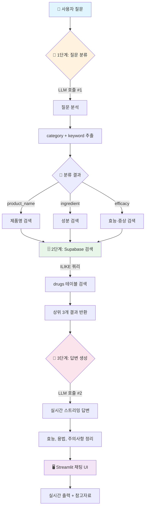

<div align="center">

# 💊 의약품 정보 Q&A RAG 시스템

[](https://python.org)
[](https://streamlit.io)
[](https://openai.com)
[](https://langchain.com)
[](https://supabase.com)

<br/>

**식품의약품안전처 공공 API 기반 의약품 정보 검색 챗봇**

</div>

---

> [!CAUTION]
> **⚠️ 의료 면책 조항 (Medical Disclaimer)**
> 
> 본 시스템은 **의료 정보 제공**만을 목적으로 하며, **복약지시, 의료 진단, 처방의 의도**가 **전혀 없습니다**.
> 
> - 🔴 이 시스템의 응답은 AI가 공공 데이터를 기반으로 생성한 것으로, **정확성을 보장하지 않습니다.**
> - 🔴 복약지시나 진단으로 해석될 수 있는 답변이 출력될 경우, 이는 **시스템 오류이며 의도된 것이 아닙니다.**
> - 🔴 **모든 의약품 복용 및 건강 관련 결정은 반드시 의사 또는 약사와 상담 후 진행하세요.**
> - 🔴 본 시스템 사용으로 인한 **어떠한** 직접적, 간접적 **피해**에 대해서도 **책임지지 않습니다.**
>
> **본 시스템을 사용하면 위 내용에 동의한 것으로 간주됩니다.**

---

## 📋 목차

- [기술 스택](#-기술-스택)
- [프로젝트 구조](#-프로젝트-구조)
- [RAG 체인 구조](#-rag-체인-구조)
- [실행 방법](#-실행-방법)
- [질문 예시](#-질문-예시)
- [데이터 소스](#-데이터-소스)
- [데이터베이스 스키마](#-데이터베이스-스키마)

---

## 🛠 기술 스택

[](https://streamlit.io)
[](https://openai.com)
[](https://supabase.com)
[](https://langchain.com)
[](https://smith.langchain.com)

| 분류 | 기술 | 설명 |
|:---:|:---:|:---|
| 🖥️ **UI** | Streamlit | 인터랙티브 웹 애플리케이션 |
| 🤖 **LLM** | GPT-4.1-nano | 질문 분류 및 답변 생성 |
| 🗄️ **Vector DB** | Supabase (PostgreSQL) | pgvector 기반 벡터 저장소 |
| 🔗 **Orchestration** | LangChain (LCEL) | RAG 파이프라인 구성 |
| 📊 **Tracing** | LangSmith | LLM 호출 모니터링 |

---

## 📁 프로젝트 구조

```
📦 SKN22-3rd-1Team/
├── 🚀 app.py                      # Streamlit 웹 애플리케이션 (스트리밍 지원)
├── 📋 requirements.txt            # Python 의존성
├── 🔐 .env                        # 환경 변수 (API 키)
│
├── 📂 src/
│   ├── ⚙️ config.py               # 설정값 (모델, API 등)
│   ├── 🔗 chain/
│   │   ├── rag_chain.py           # LCEL RAG 체인 (분류→검색→생성)
│   │   ├── retriever.py           # Supabase drugs 테이블 검색
│   │   └── prompts.py             # 분류기 + 답변 생성 프롬프트
│   ├── 📊 data/
│   │   ├── collector.py           # 공공 API 데이터 수집
│   │   ├── loader.py              # Document 생성
│   │   └── preprocessor.py        # 데이터 전처리 및 병합
│   ├── 🗄️ vectorstore/
│   │   ├── supabase_store.py      # Supabase 벡터 저장소 관리
│   │   ├── embeddings.py          # 임베딩 모델 초기화
│   │   └── ingest.py              # 데이터 수집→업로드 파이프라인
│   └── 🛠️ utils/
│       └── langsmith_config.py    # LangSmith 설정
│
├── 📂 scripts/
│   ├── collect_data.py            # 데이터 수집 스크립트
│   └── ingest_to_supabase.py      # 전체 파이프라인 실행 스크립트
│
└── 📂 data/
    ├── raw/                       # 원본 데이터 (JSON)
    └── processed/                 # 전처리된 데이터
```

---

## 🔄 RAG 체인 구조



---

## 🚀 실행 방법

### 1️⃣ 의존성 설치

```bash
pip install -r requirements.txt
```

### 2️⃣ 환경 변수 설정

프로젝트 루트에 `.env` 파일을 생성합니다.

```env
# OpenAI API
OPENAI_API_KEY=sk-...

# Supabase
SUPABASE_URL=https://...
SUPABASE_KEY=...

# LangSmith
LANGSMITH_API_KEY=...

# 공공데이터포털
MC_DATA_API=...
```

### 3️⃣ 데이터 수집 및 업로드 (최초 1회)

```bash
# 전체 파이프라인 실행
python scripts/ingest_to_supabase.py
```

### 4️⃣ 애플리케이션 실행

```bash
streamlit run app.py
```

🌐 브라우저에서 `http://localhost:8501`로 접속합니다.

---

## 💬 질문 예시

<table>
<tr>
<td>

**🏷️ 제품명 검색**
```
타이레놀의 효능은 무엇인가요?
```

</td>
<td>

**🧪 성분 검색**
```
아세트아미노펜이 포함된 약은?
```

</td>
<td>

**💊 증상 검색**
```
두통에 효과있는 약은?
```

</td>
</tr>
</table>

---

## 📊 데이터 소스

### 📌 API 1: 의약품개요정보 (e약은요)

| 항목 | 값 |
|:---:|:---|
| **서비스 ID** | `DrbEasyDrugInfoService` |
| **데이터 수** | ~4,740건 |
| **주요 필드** | 효능, 사용법, 주의사항, 부작용, 상호작용 |

### 📌 API 2: 의약품 허가정보

| 항목 | 값 |
|:---:|:---|
| **서비스 ID** | `DrugPrdtPrmsnInfoService07` |
| **주요 필드** | 주성분, 성상, 허가일자, 전문/일반 구분 |

> [!NOTE]
> 두 API 데이터는 **`itemSeq`(품목기준코드)** 기준으로 병합됩니다.

---

## ⚙️ 주요 설정값

| 항목 | 값 | 설명 |
|:---:|:---:|:---|
| 🤖 **분류기 모델** | `gpt-4.1-nano` | 질문 의도 파악 |
| 💬 **답변 생성 모델** | `gpt-4.1-mini` | 최종 답변 생성 |
| 🔍 **검색 결과 수 (k)** | `3` | 상위 k개 문서 반환 |
| 🌡️ **Temperature** | `0.0` | 결정적 답변 생성 |

---

## 🗄️ 데이터베이스 스키마 (Supabase)

### 📋 drugs 테이블

의약품 정보를 저장하는 테이블입니다.

| 컬럼명 | 설명 | 출처 |
|:---|:---|:---:|
| `item_seq` | 품목기준코드 (UNIQUE) | API 1 |
| `item_name` | 제품명 | API 1 |
| `entp_name` | 업체명 | API 1 |
| `efcy_qesitm` | 효능·효과 | API 1 |
| `use_method_qesitm` | 사용법 | API 1 |
| `atpn_qesitm` | 주의사항 | API 1 |
| `se_qesitm` | 부작용 | API 1 |
| `intrc_qesitm` | 상호작용 | API 1 |
| `main_item_ingr` | 주성분 | API 2 |
| `chart` | 성상 | API 2 |
| `item_permit_date` | 허가일자 | API 2 |
| `spclty_pblc` | 전문/일반 구분 | API 2 |

### 📋 documents 테이블

LangChain 벡터 임베딩을 저장합니다. (pgvector 확장 사용)

| 컬럼명 | 타입 | 설명 |
|:---|:---:|:---|
| `id` | `UUID` | 문서 ID |
| `content` | `TEXT` | 문서 텍스트 |
| `metadata` | `JSONB` | 메타데이터 |
| `embedding` | `VECTOR(1536)` | 벡터 임베딩 |

---

## 📜 라이선스

<div align="center">

이 프로젝트는 **식품의약품안전처**의 공공 데이터를 활용합니다.

[](https://www.mfds.go.kr)
[](https://data.go.kr)

---

**SKN22-3rd-1Team**

</div>
